**THIS GUIDE IS CURRENTLY IN ALPHA STATE. THE FEATURES COVERED WITHIN ARE FUNCTIONAL, HOWEVER THE STEPS IN THIS GUIDE MAY NOT BE COMPLETE. IF YOU USE THIS GUIDE, PLEASE LET US KNOW IF YOU HAVE ANY PROBLEMS OR SUGGESTIONS FOR IMPROVEMENT BY OPENING AN ISSUE TICKET. ALSO PLEASE ENTER A VALIDATION STAMP IF THE LAB WORKED FOR YOU. THANK YOU.** 

# Tanzu Mission Control - Attaching Unmanaged Namespaces Lab Guide

**Contents:**

- [Introduction](#introduction)
- [Attaching a single unmanaged namespace](#attaching-a-single-unmanaged-namespace)
- [Attaching multiple unmanaged namespaces with bulk-attach](#attaching-multiple-unmanaged-namespaces-with-bulk-attach)
- [Reserved Namespaces](#reserved-namespaces)
- [Detaching Managed Namespaces](#detaching-managed-namespaces)
- [Deleting Managed Namespaces](#deleting-managed-namespaces)
- [Namespace Status](#namespace-status)

## Introduction

This document is intended to provide a guide to attach unmanaged namespaces in TMC through its UI. This converts an unmanaged namespace to a TMC managed namespace. Managing a namespace via TMC gives you the ability to manage policies on that namespace, including inheriting policies applied for the whole organization or set of namespaces (on workspace)

### Environment Pre-Requisites

The demo in this document is conducted with a development TMC stack in which a Kind cluster is attached. A few namespaces are pre-created directly on this cluster. Since these namespaces are not created in TMC, these are termed "unmanaged" namespaces.

Screenshot

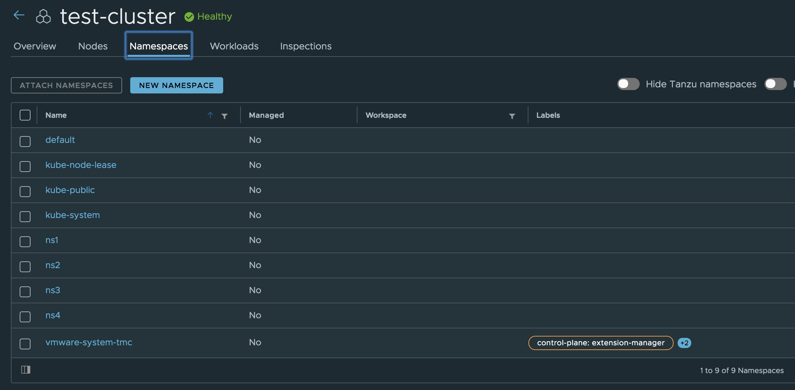

### Before Attempting This Lab:

This lab has a completion difficulty of `Partial`. Please see the rubrik below for an explanation of lab completion difficulty rankings

Lab Completion Difficulty Rankings:

- Lab Completion Difficulty is not a measure of how complex or difficult a topic is, it is a measure of how thorough the instructions are in the provided lab guide:
- Difficulty Levels:
  - `Complete`
    - A lab guide with a difficulty of `Complete` includes comprehensive, click-by-click instructions, usually with a screenshot for every command entered. Complete labs must be associated with an online lab environment fully prepped to execute the exact instructions provided in the lab guide. Most users could successfully execute the steps in a `Complete` lab guide, even if they do not have expertise in the subject, by following detailed instructions.
  - `Partial`
    - A lab guide with a difficulty of `Partial` includes full instructions to complete the exercise, with enough detail to where a user with moderate experience in the subject matter could complete the exercise. `Partial` lab guides provide a level of detail similar to most technical documentation or blogs, where the user is expected to be able to configure their lab environment with dependencies required for the exercise, and to contextualize general instructions to the users own environment. 
  - `Challenge`
    - A lab guide with a difficulty of `Challenge` is designed to be technically challenging for the guide's target audience to complete. `Challenge` lab guides do not include comprehensive instructions, and intentionally leave out details required to complete exercises as a challenge or test of the users proficiency in a topic.

## Attaching a single unmanaged namespace

#### Step1: Log into TMC & Go to Namespaces page

#### Step2: Click on the namespace you want to attach

#### Step3: Click on "Actions" in the top right corner of the page and then click on "Attach"

In the below screenshot, you can see the action named "Attach" on the top right corner of "ns1" namespace page

Screenshot

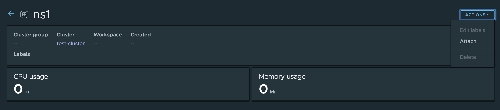

#### Step4: Choose the workspace in which you want to add this namespace, and click on "Attach"

In the below screenshot, you can see the page to select a workspace. Once a valid existing workspace is selected, the "Attach" button will be enabled.

Screenshot

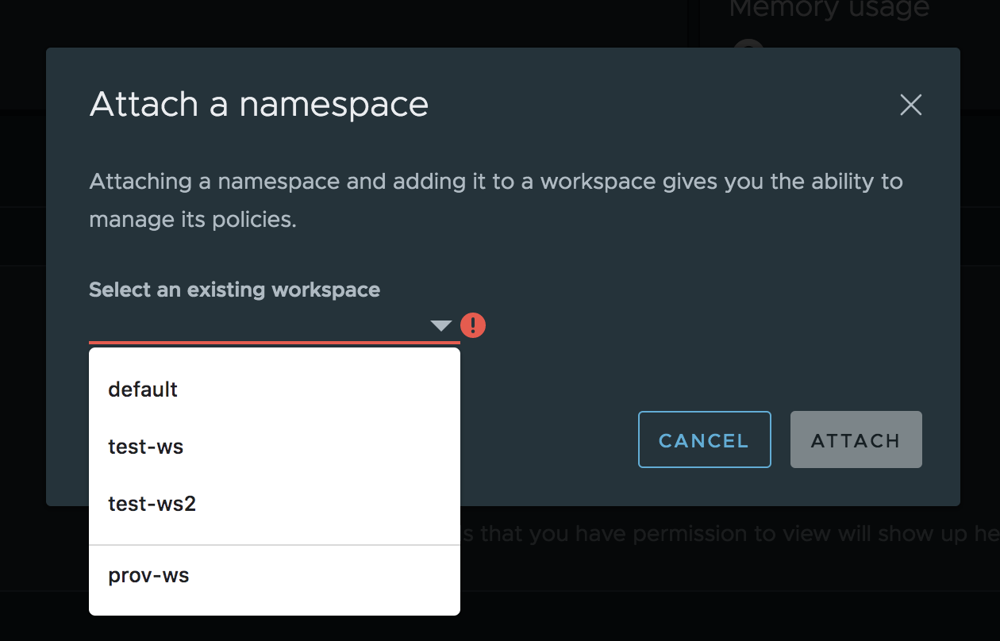

#### Step5: Wait for namespace to get attached. 

In the below screenshot, you can see that the namespace "ns1" now shows Managed=Yes and shows the workspace it belongs to. You also see the TMC system labels applied on this namespace.

Screenshot

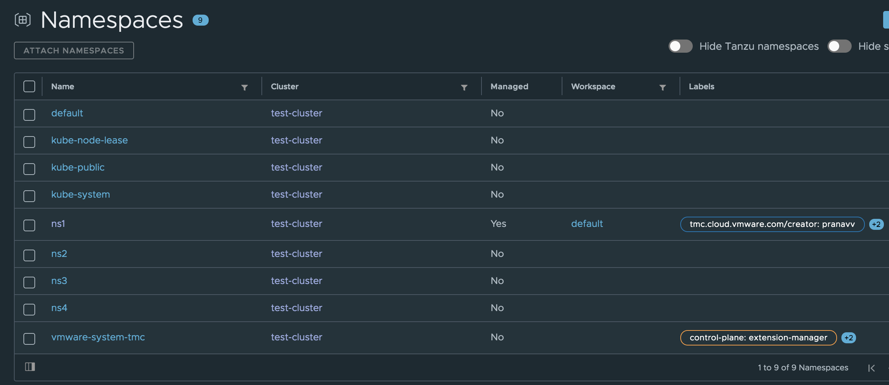

## Attaching multiple unmanaged namespaces with bulk-attach

#### Step1: Go to Namespaces page

#### Step2: Click on the checkboxes of the namespaces you want to attach

In the below screenshot, 2 namespaces "ns1" and "ns2" are selected

Screenshot

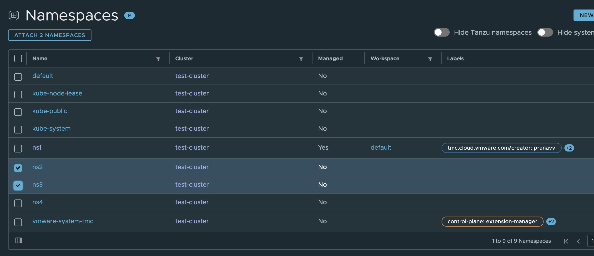

#### Step 3: Click on "Attach x Namspaces" button on the top left corner as seen in the above screenshot

#### Step 4: Choose the workspace in which you want to add all the selected namespaces, and click on "Attach"

Note that you can bulk-attach namespaces to a single workspace. If you wish to attach some namespaces to a different workspace, you will need to follow the steps again by selecting those namespaces.

Screenshot

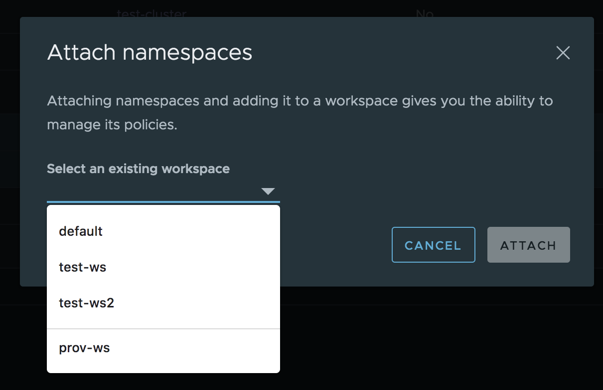

#### Step5: Wait for selected namespaces to get attached. 

In the below screenshot, you can see that the namespaces "ns2" and "ns3" now shows Managed=Yes
Note: Sometimes, there could be a delay till you see the TMC system labels on the newly attached namespaces

Screenshot

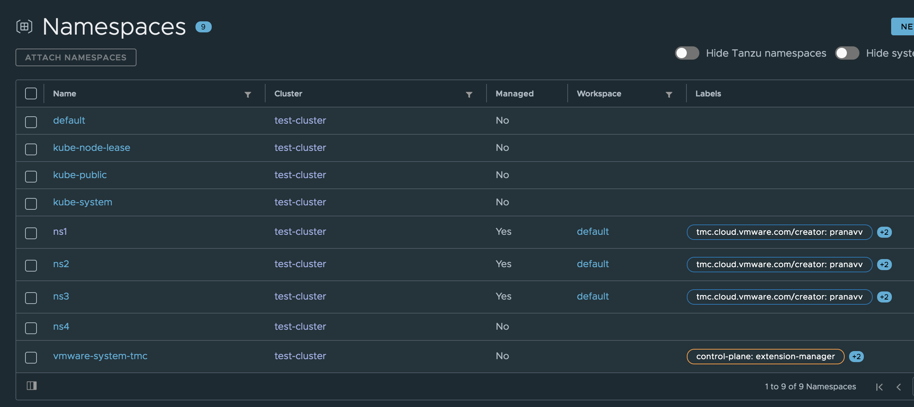

## Reserved Namespaces

- Kubernetes system namespaces like "kube-system", "kube-public" and Tanzu system namespaces like "vmware-system-tmc" are classified as reserved namespaces in TMC
- This means these namespaces cannot be attached to TMC
If you try to attach these namespaces, you will see an error as below:

Screenshot - attempt to attach reserved "kube-system" namespace

Screenshot - error message after attempt to attach reserved namespace

 

- Note that you can hide these namespaces from UI using the toggles at the top right corner of the Namespaces page.
- In the future, we plan to disable the checkboxes on UI for reserved namespaces, so that you can't attempt to attach them

## Detaching Managed Namespaces

- We currently don't support detaching any managed namespace (we do plan to support this in the future)
- This means once an unmanaged namespace is attached and becomes a managed namespace, you cannot change it back to unmanaged
- This means, as of right now, an action to attach a namespace cannot be undone
- Attached namespace can be deleted same way as any other managed namespace

## Deleting Managed Namespaces

#### Step1: Go to Namespaces page

#### Step2: Click on the namespace you want to delete

#### Step3: Click on "Actions" in the top right corner of the page and then click on "Delete"

In the below screenshot, you can see the action named "Delete" on the top right corner of "ns1" namespace page
This "Delete" action is only visible for managed namespaces. You will not see this action on an unmanaged namespace page

Screenshot

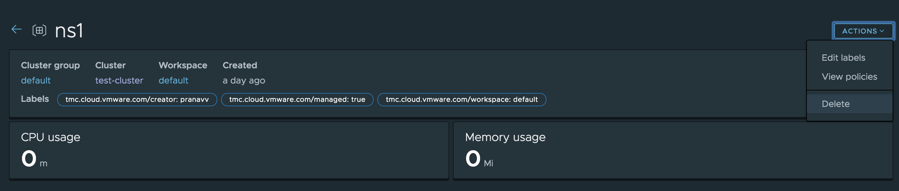

#### Step 4: Confirm deleting the namespace

After clicking on "Delete" action in Step 3, you will be given a warning and get asked for confirmation before deleting the namespace as in the below screenshot

Screenshot

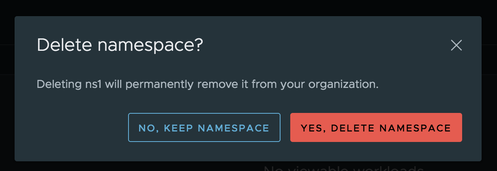

#### Step 5: Namespace gets deleted from TMC system, but it is still being deleted in the actual cluster. There is a short reconciliation delay after a namespace is deleted in TMC till it gets deleted from the actual cluster.

We understand that this behavior can be confusing to the user and we plan to improve it in the future (for example, by adding a Status column which shows that the namespace is being deleted till it actually gets deleted on the cluster)

In the below screenshot, you can see that namespace "ns1" is still shown on the UI for a short time after it is deleted. At this point, you see it as Managed=No, but you still see the system labels on the namespace

Screenshot

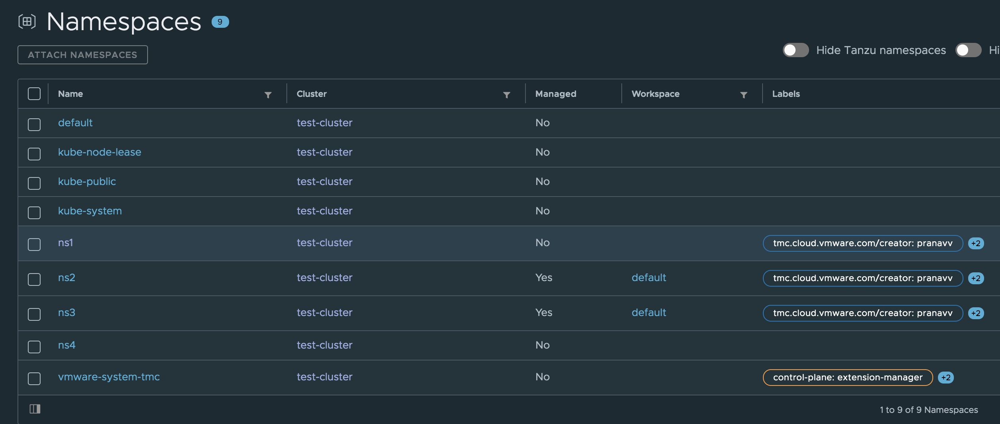

#### Step 6: Refresh the page in a few seconds and the namespace will no longer be seen on the UI

In the below screenshot, the namespace "ns1" is no longer seen. This was after refreshing the page from above screenshot after just 2 or 3 seconds

Screenshot

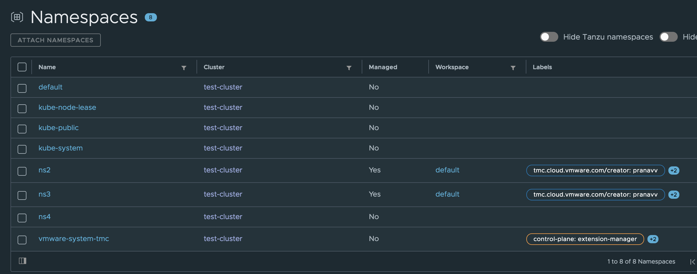

## Namespace Status (Future Intent)

- Currently, we don't show the status of a namespace which is being attached or created or deleted
- This is why, sometimes you can see delays till a namespace appears or till you see Managed=Yes or till you see the TMC system labels on UI and on the actual namespace. You can also see these delays while deleting a namespace as shown above
- Please refresh the page a few times for the correct information to appear if you experience these delays
- In the future, we intend to add a Status column to these namespaces, so that you can view the current status of a namespace that is being attached or created or deleted, which will make it a lot more user friendly

## Sign the Validation Stamp

If you were able to complete this lab successfully without any significant problems, please sign the validate.md file located in this directory. 

If you encountered any problems, please open an issue ticket on this repository. 

If you have any updates or improvements for this lab guide, please open a PR with your updates.

### Thank you for completing the Tanzu Mission Control - Attaching Unmanaged Namespaces Lab Guide!